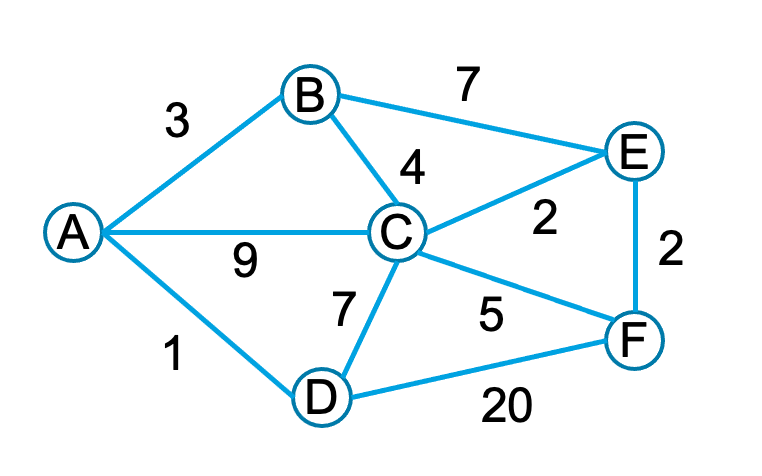

# PROG VIII: Dijkstra Algoritme

Student:

Studentnummer:

## Dijkstra's kortste pad

De bekende Nederlandse informaticus Dijkstra heeft een beroemd algoritme ontwikkeld om het kortste pad te bepalen tussen twee plaatsen. 
Bijvoorbeeld een treinreis tussen Utrecht en Enschede, wel of niet via Amersfoort, een autorit tussen Amsterdam en Marseille, via Brussel of Maastricht, 
maar je kunt "kortste" ook lezen als goedkoopste, bijvoorbeeld bij vliegreizen, of beste, bijvoorbeeld de minste kans op vertragingen. 
Je kunt het Dijkstra-algoritme uitstekend gebruiken om te laten zien dat je OO programmeren goed begrijpt door verschillende type verbindingen te implementeren.

## Opdracht

Implementeer het Dijkstra algoritme om voor een reis het kortste pad te bepalen. 
Je project moet voldoen aan een aantal eisen:
- Het algoritme maakt gebruik van std::priority_queue 
  - waar in de code deze precies voorkomt verwachten we dat je naar eigen inzicht kan bepalen
  - Het type dat je aan priority_queue meegeeft moet "comparable" zijn  
- Je maakt gebruik van polymorphism om verschillende soorten verbindingen te kunnen vergelijken. 
  - Hierbij is in ieder geval een abstract class edge en drie subclasses die staan voor een autorit, treinrit of vlucht.
  - Er is een bewuste keuze gemaakt over wat allemaal vergelijkbaar is met wat
  - Wanneer je een route wil vinden, geef je aan welk type verbindingen allemaal gebruikt mogen worden
- Je hebt een oplossing met een test die minimaal aantoont dat je algoritme voor onderstaande graaf het juiste antwoord geeft. 
  - Dit moet ook een antwoord zijn dat makkelijk leesbaar is voor anderen bij het draaien
  - Je test moet aantonen dat je implementatie van polymorphism correct is
  -  
- Je hebt een class diagram in UML gemaakt en geëxporteerd naar pdf

